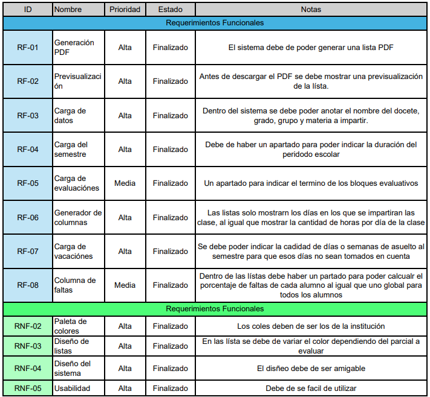

# Requerimientos

## Alcance

- Se solicito un sistemas el cual debe genera una lista de asistencia en PDF por medio de un registro manual y previo a descargar el PDF se mostrar una previsualización del mismo. Esta lista debe de contar con los datos de la materia al igual que con los días, las horas en las que se imparte la materia y los espacios disponibles para anotar a los alumnos. Todo esto para que el docente tenga un registro de las asistencias de sus alumnos.

## Limitaciones

- Dado que el sistema es exclusivo para la generación de listas de asistencia este no puede almacenar listas de otros años ni otros grupos del año en curso puesto que una vez que el registro finalice toda la información se eliminara del sistema de manera automática. Cada que se deba crear una lista se deberá de rehacer el registro de la materia desde cero, la cantidad máxima de los alumnos es de 50.
